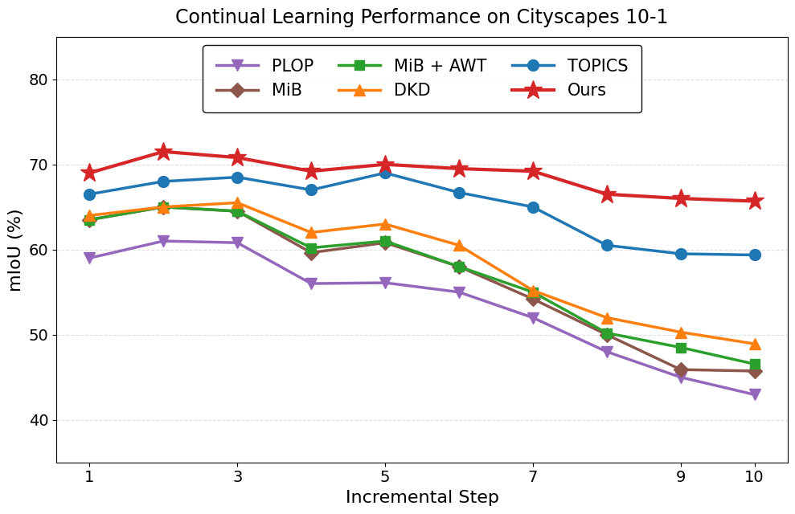
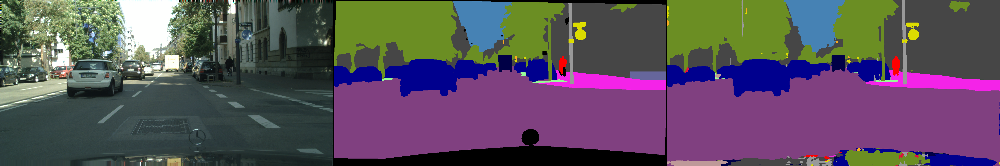

# PILOT

PILOT: A Data-Free Continual Learning Approach for Real-Time Semantic Segmentation via Boundary Guidance

## Highlights

- Real-Time Continual Learning: PILOT enables incremental class learning on PIDNet without retraining, maintaining real-time inference speeds for autonomous driving deployment.
- Data-Free & Replay-Free: Trains exclusively on new-class data without storing or revisiting previous samples, eliminating memory overhead
- Lightweight Design: Adds only a small parallel branch on top of a frozen backbone, preserving the original network's real-time efficiency.

## Updates

- TODO: update 1
- TODO: update 2
- Upload all the code (5/8/2026)

## Overview

